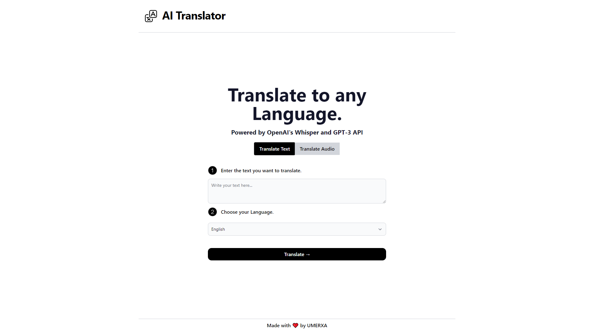

# [AI Translator]

This project translates any text and audio for you using AI.

[]

## How it works

This project uses OpenAI's advanced AI technologies, including the GPT-3 API and Whisper API, to provide fast and accurate translations. The Translate Text component generates translations based on user input, while the Translate Audio component transcribes audio to text and translates it to any language. This tool is perfect for anyone looking to communicate across language barriers, making language learning and international communication easier than ever before.

## Running Locally

After cloning the repo, go to [OpenAI](https://beta.openai.com/account/api-keys) to make an account and put your API key in a file called `.env`.

Then, run the application in the command line and it will be available at `http://localhost:3000`.

```bash
npm run dev
```

## One-Click Deploy

Deploy the example using [Vercel](https://vercel.com?utm_source=github&utm_medium=readme&utm_campaign=vercel-examples):

[](https://vercel.com/new/clone?repository-url=https://github.com/Nutlope/twitterbio&env=OPENAI_API_KEY&project-name=twitter-bio-generator&repo-name=twitterbio)
